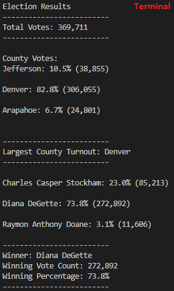
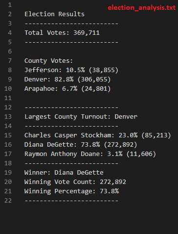

# 2018 Colorado District 1 Election Audit and Analysis

## Overview of Election Audit
A Colorado Board of Elections employee has requested completion of the following tasks to perform an audit of a recent local congressional election (CO-01):

1. Calculate the total number of votes cast.
2. Get a complete list of candidates who received votes.
3. Calculate the total number of votes each candidate received.
4. Calculate the percentage of votes each candidate won.
5. Determine the winner of the election based on popular vote.

Following this analysis, they requested some additional information to complete their audit:

6. Calculate the voter turnout for each county.
7. Calculate the percentage of votes from each county out of the total count.
8. Determine which county had the highest turnout.

A .csv file was provided with the election results containing three types of information: ballot ID, county, and the name of the candidate for whom the vote was cast. A script was written in Python to perform the above calculations on the provided dataset and to then output the results to a .txt file.

Following the successful audit and certification of this US congressional race, the Colorado BoE plans to extend this script for use in other applications: other congressional districts, as well senatorial districts and local elections.

## Resources
- Data Source: election_results.csv
- Software: Python 3.9.13, Visual Studio Code 1.73.1

## Election Audit Analysis and Results
The [Python code](PyPoll_Challenge.py) successfully performed the required calculations and determinations, outputting the following results to the terminal and to [election_analysis.txt](analysis/election_analysis.txt):

     

The results and analysis of the election are shown here:
- There were **369,711 total votes** cast in the election.
- The county-level results were (alphabetically):
    - Arapahoe County cast **24,801 votes** or **6.7%** of the total vote share.
    - Denver County cast **306,055 votes** or **82.8%** of the total vote share.
    - Arapahoe County cast **38,855 votes** or **10.5%** of the total vote share.
- The county that had the highest voter turnout was ***DENVER COUNTY***!
- The candidates were (alphabetically by last name):
    - Diana DeGette (DEM)
    - Raymon Anthony Doane (LIB)
    - Charles Casper Stockham (REP)
- The candidate results were:
    - Diana DeGette received **73.8%** of the vote with **272,892 votes**.
    - Raymon Anthony Doane received **3.1%** of the vote with **11,606 votes**.
    - Charles Casper Stockham received **23.0%** of the vote with **85,213 votes**.
- The winner of the election was ***DIANA DeGETTE***! She received **73.8%** of the vote with **272,892 votes**.

## Election Audit Summary
The code as it currently exists is already fairly robust and scalable for national races (e.g. President, Senator, or House elections) or statewide races (e.g. Governor, State Senator, Attorney General) since these elections can be tabulated and reported at the county level. Assuming the data is reported separately from individual counties for these races, the code would have to import each county's vote data, tabulate the votes for each, and then add up the county-level vote totals to determine statewide winners.

At a more local level, such as county or city elections, votes need to be split into more granular divisions such as precincts. The code would change simply by replacing the county names and tallies with precint numbers and tallies. This precinct-level data could also be scaled back up for statewide, county-level reporting by defining groups of precincts in the code as counties and using For loops to sum up the precinct-level tallies for an individual county.

In presidential elections, vote talleys are reported to various news sources in batches as they are tabulated to give the public a real-time look at the results. The results would still be reported at a county- or precinct-level, but the total number of votes cast would need to be known up front in order to calculate what percentage of votes had been counted so far. News stations often show this number at the bottom of a state's vote map on election night: e.g. "79.1% of Votes Reported". In the code, the number of votes reported would be divided by the total votes cast to give viewers an idea of how many votes remain to be reported throughout the night.

Another common item that people vote for are ballot initiatives. Rather than having several possible candidates, the only choices for these initiatives are 'yes' or 'no'. Tabulating results for these initiatives would require a relatively simple change to the code where instead of defining and searching for candidate names, it would only have to search the results for an exact 'yes' or 'no' and add up the results accordingly.

Outside of official election reporting activities, the Colorado Board of Elections could potentially license this code and their data to the various political parties. The parties rely on this precinct-level data to know where the highest concentrations of their voters are located so that they can more effectively plan door-knocking activities and other Get-Out-The-Vote drives.